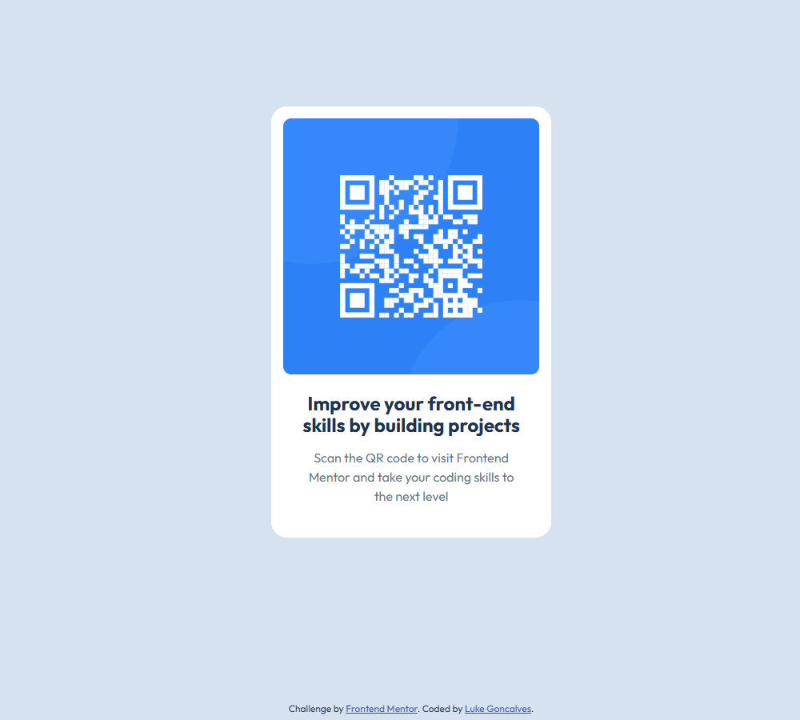

# Frontend Mentor - QR code component solution

This is a solution to the [QR code component challenge on Frontend Mentor](https://www.frontendmentor.io/challenges/qr-code-component-iux_sIO_H). Frontend Mentor challenges help you improve your coding skills by building realistic projects. 

## Table of contents

- [Overview](#overview)
  - [Screenshot](#screenshot)
  - [Links](#links)
- [My process](#my-process)
  - [Built with](#built-with)
  - [What I learned](#what-i-learned)
  - [Continued development](#continued-development)
- [Acknowledgments](#acknowledgments)

## Overview

### Screenshot

### Links

- [Solution on GitHub](https://github.com/Smasheroonie/qr-code-compontent/tree/main)
- [Hosted Solution](https://smasheroonie.github.io/qr-code-compontent/)

## My process

### Built with

- Semantic HTML5 markup
- CSS custom properties
- Flexbox
- [Outfit Google Font](https://fonts.google.com/specimen/Outfit)
- A bit of Googling

### What I learned

This was a great opportunity to recap the basics of HTML and CSS. I had a lovely time using the vanilla layouts and rules, and I'm proud of the result!

### Continued development

It's so interesting figuring out all the ways elements can be aligned and positioned. I'm particularly interested in learning as much as I can about Flexbox.

From now on, I'll be focusing on using Tailwind CSS where possible.

## Acknowledgments

This is one of my very first complete projects, and this journey all started thanks to Northcoders. They have done a great job teaching me and the rest of the cohort on the JavaScript Bootcamp. I can't wait to learn more and present more projects soon!
